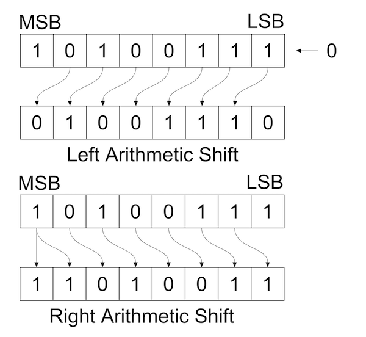
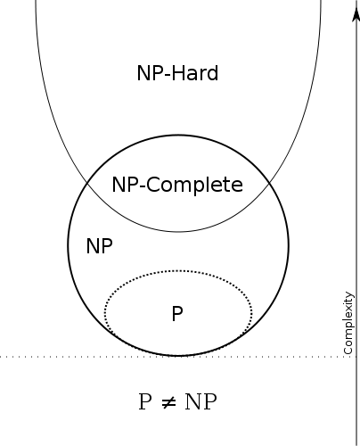

Everything later in this course — solving Bellman equations, nesting a solver inside
a likelihood, finding all equilibria of a game — is limited by how fast the inner
loop runs. This class is about what makes an algorithm fast, and how to tell before
you write it.

````{hint} Running the code for this lecture
:class: dropdown

Every code example below is also a runnable notebook in the course **code
repository**.

Navigate to the directory you chose to save the course materials (must be different from the homework repository!), and clone the code repo once:

```bash
git clone https://github.com/fediskhakov/sb-dse-code.git
cd sb-dse-code
```

The notebook for today is `session03-sep1/algorithms.ipynb`. Open it in VS Code directly or with

```bash
jupyter lab session03-sep1/algorithms.ipynb
```

The repository is read-only for you. Nothing in it is submitted, so experiment
freely — but once you have edited a file in place `git pull` refuses to update it.
So either copy anything you want to keep out of this repo, or commit to a separate branch, and remove all your changes by running

```bash
git reset --hard HEAD
```
Setting up the Python environment is covered in
[](2_workflow.md#python-install).
````

## Writing programs that work fast

````{tip} Example: evaluation of polynomials

**Task:** evaluate the polynomial of the form at a given $x$

$$
y = a_1 + a_2 x + a_3 x^2 + \dots + a_k x^k
\label{eq:poly}
$$

```python
def calc_polynomial(qs=[0,], x=0.0):
  '''Evaluates the polynomial given by coefficients qs at given x.
  First coefficient qs[0] is a constant, last coefficient is for highest power.
  '''
  res=0.0
  for k in range(len(qs)):
    xpw = x**k
    res += qs[k] * xpw
  return res
```

:::{div}
:class: discussion

- Explain the operation of this program.
- Can you make this algorithm more efficient?
:::
````

````{tip} Example: a better approach
:class: dropdown

```python
def calc_polynomial_faster(qs=[0,], x=0.0):
  '''Evaluates the polynomial given by coefficients qs at given x.
  First coefficient qs[0] is a constant, last coefficient is for highest power.
  Faster than before!
  '''
  res, xpw = qs[0], x  # init result and power of x
  for i in range(1,len(qs)):  # start with second coefficient
    res += xpw * qs[i]
    xpw *= x
  return res
```

:::{div}
:class: discussion

- Why is this algorithm faster? What is the difference?
:::
````

An **algorithm** is a method of solving a class of problems on a computer — a
sequence of steps/commands for the computer to run.

Relevant questions:

1. How much time does it take to run?
2. How much memory does it need?
3. What other resources may be limiting? (storage, communication, etc.)

**A smart algorithm is a lot more important than a fast computer**

[Professor Martin Grötschel, Konrad-Zuse-Zentrum für Informationstechnik Berlin, expert in optimization](http://robertvienneau.blogspot.com/2011/01/increase-in-feasibility-of-economic.html)

> "a benchmark production planning model solved using linear programming would have
> taken 82 years to solve in 1988, using the computers and the linear programming
> algorithms of the day. Fifteen years later — in 2003 — this same model could be
> solved in roughly 1 minute, an improvement by a factor of roughly 43 million. Of
> this, a factor of roughly 1,000 was due to increased processor speed, whereas a
> factor of roughly 43,000 was due to improvements in algorithms!"

Algorithms are behind any computation done in economics:

- Macro simulation models (growth, heterogeneous agents, overlapping generations, etc.)
- Computationally heavy econometrics (Bayesian, MCMC, multi-dimensional fixed effects, etc.)
- Structural estimation with the need to re-solve the model many thousands of times
- Counterfactual analysis, sensitivity analysis and uncertainty quantification

Structural estimation of dynamic models is one of the areas of econometrics
requiring quick computation $\implies$ smart algorithms.

## Algorithms with different complexity

**Complexity** of an algorithm is the cost, measured in running time or in storage
requirement, of using the algorithm to solve one of the problems in the relevant class.

Let's look at some particular algorithms.

### Parity of a number

Check whether an integer is odd or even.

```
Algorithm:
Convert the number to binary
Check whether the last digit is 0 (number is even) or 1 (number is odd)
```

```{code-cell} python3
:tags: [hide-input, remove-output]

def parity(n, verbose=False):
  '''Returns 1 if passed integer number is odd
  '''
  if not isinstance(n, int): raise TypeError('Only integers in parity()')
  if verbose: print('n = ', format(n, "b"))  # print binary form of the number
  return n & 1  # bitwise and operation returns the value of last bit
```

```{code-cell} python3
# check parity of various numbers
for n in [2,4,7,32,543,671,780]:
  print('n = {0:5d} ({0:08b}), parity={1:d}'.format(n,parity(n)))
```

````{note} Some details on bitwise operations
:class: dropdown

**Bitwise operations in Python**

- bitwise AND `&`
- bitwise OR `|`
- bitwise XOR `^`
- bitwise NOT `~` (including sign bit!)
- right shift `>>`
- left shift `<<` (without overflow!)

**Bitwise AND, OR and XOR**

|     |   |   |   |   |   |
|-----|---|---|---|---|---|
| 7   | = | 0 | 1 | 1 | 1 |
| 4   | = | 0 | 1 | 0 | 0 |
| **7 AND 4** | = | 0 | 1 | 0 | 0 = 4 |

|     |   |   |   |   |   |
|-----|---|---|---|---|---|
| 7   | = | 0 | 1 | 1 | 1 |
| 4   | = | 0 | 1 | 0 | 0 |
| **7 OR 4**  | = | 0 | 1 | 1 | 1 = 7 |

|     |   |   |   |   |   |
|-----|---|---|---|---|---|
| 7   | = | 0 | 1 | 1 | 1 |
| 4   | = | 0 | 1 | 0 | 0 |
| **7 XOR 4** | = | 0 | 0 | 1 | 1 = 3 |

**Bit shifts in Python**


````

```{code-cell} python3
:tags: [hide-input]

import matplotlib.pyplot as plt
plt.rcParams['figure.figsize'] = [9, 6]

N = 50
kk = lambda i: 10**(i+1)+i  # step formula
n,x,std = [0]*N,[0]*N,[0]*N # initialize data lists
for i in range(N):
  k = kk(i)  # input value for testing
  n[i] = k.bit_length() # size of problem = bits in number
  t = %timeit -n5000 -r100 -o -q parity(k)
  x[i] = t.average
  std[i] = t.stdev

plt.errorbar(n,x,std)
plt.xlabel('number of bits in the input argument', fontsize=14)
plt.ylabel('run time, sec', fontsize=14)
plt.title("Run times for parity check as function of number length in bits",fontsize=14)
plt.show()
```

### Finding max/min of a list

Find max or min in an unsorted list of values.

```
Algorithm:
cycle through the list once saving the current extremum value
```

```{code-cell} python3
:tags: [hide-input, remove-output]

def maximum_from_list(vars):
  '''Returns the maximum from a list of values
  '''
  m=float('-inf')  # init with the worst value
  for v in vars:
    if v > m: m = v
  return m
```

```{code-cell} python3
:tags: [hide-input]

import numpy as np
N = 50
kk = lambda i: 2*i  # step formula
n,x,std = [0]*N,[0]*N,[0]*N # initialize data lists
for i in range(N):
  n[i] = kk(i) # size of the array
  vv = np.random.uniform(low=0.0, high=100.0, size=n[i])
  t = %timeit -n1000 -r100 -o -q maximum_from_list(vv)
  x[i] = t.average
  std[i] = t.stdev

plt.errorbar(n,x,std)
plt.xlabel('number of elements in the list', fontsize=14)
plt.ylabel('run time, sec', fontsize=14)
plt.title("Run times for max finder as function of the array length",fontsize=14)
plt.show()
```

### Binary search in a finite set

Finding a discrete element between given boundaries.

````{tip} Example

1. Think of a number between 1 and 100
2. How many guesses are needed to locate it if the only answers are "below" and "above"?
3. What is the optimal sequence of questions?
````

:::{div}
:class: discussion

Explain the operation of the code below.
:::

```{code-cell} python3
:tags: [hide-input, remove-output]

def binary_search(grid=[0,1],val=0):
  '''Returns the index of val on the sorted grid
  '''
  i1,i2 = 0,len(grid)-1
  if val==grid[i1]: return i1
  if val==grid[i2]: return i2
  j=(i1+i2)//2
  while grid[j]!=val:
    if val>grid[j]:
      i1=j
    else:
      i2=j
    j=(i1+i2)//2  # divide in half
  return j
```

```
Inputs: sorted list of numbers, and a value to find
Algorithm:
1. Find middle point
2. If the sought value is below, reduce the list to the lower half
3. If the sought value is above, reduce the list to the upper half
```

```{code-cell} python3
import numpy as np
N = 10
# random sorted sequence of integers up to 100
x = np.random.choice(100,size=N,replace=False)
x = np.sort(x)
# random choice of one number/index
k0 = np.random.choice(N,size=1)
k1 = binary_search(grid=x,val=x[k0])
print(f'Index of x{k0}={x[k0]} in {x} is {k1}')
```

```{code-cell} python3
:tags: [hide-input]

N = 50  # number of points
kk = lambda i: 100+(i+1)*500  # step formula
# precompute the sorted sequence of integers of max length
vv = np.random.choice(10*kk(N),size=kk(N),replace=False)
vv = np.sort(vv)

n,x,std = [0]*N,[0]*N,[0]*N   # initialize lists
for i in range(N):
  n[i] = kk(i)  # number of list elements
  # randomize the choice in each run to smooth out simulation error
  t = %timeit -n10 -r100 -o -q binary_search(grid=vv[:n[i]],val=vv[np.random.choice(n[i],size=1)])
  x[i] = t.average
  std[i] = t.stdev

plt.errorbar(n,x,std)
plt.xlabel('number of elements in the list', fontsize=14)
plt.ylabel('run time, sec', fontsize=14)
plt.title("Run times for binary search as function of the array length",fontsize=14)
plt.show()

plt.errorbar(n,x,std)
plt.xscale('log')
plt.xlabel('log(number of elements in the list)', fontsize=14)
plt.ylabel('run time, sec', fontsize=14)
plt.title("Run times for binary search as function of the LOG of array length",fontsize=14)
plt.show()
```

## Rate of growth and big-O notation

A very useful way to talk about the rate of growth $\leftrightarrow$ complexity of
algorithms.

````{attention} Definition

$$f(n)=O\big(g(n)\big) \text{ as } n \to \infty \Leftrightarrow$$

$$\exists M>0 \text{ and } N \text{ such that } |f(n)| < M g(n)  \text{ for all } n>N$$
````

In words, $f(x) = O\big(g(x)\big)$ simply means that as $x$ increases, $f(x)$
certainly does not grow at a faster rate than $g(x)$.

In measuring solution time we may distinguish performance in

- best (easiest to solve) case
- average case
- worst case ($\leftarrow$ the focus of the theory!)

Constants and lower terms are ignored because we are only interested in the *order*
of growth.

### Classes of algorithm complexity

- $O(1)$ constant time
- $O(\log_{2}(n))$ logarithmic time
- $O(n)$ linear time
- $O(n \log_{2}(n))$ quasi-linear time
- $O(n^{k}), k>1$ quadratic, cubic, etc. **polynomial** time ↑ **tractable**
- $O(2^{n})$ exponential time ↓ **curse of dimensionality**
- $O(n!)$ factorial time

```{image} _static/img/bigO.png
:width: 50%
:align: center
```

### How many operations as function of input size?

- Parity: just need to check the lowest bit, does not depend on input size $\Rightarrow O(1)$
- Maximum element: need to loop through elements once $\Rightarrow O(n)$
- Binary search: divide the problem in 2 each step $\Rightarrow O(\log(n))$

## Divide-and-conquer algorithms

```{image} _static/img/binary.png
:width: 80%
:align: center
```

Divide-and-conquer structure is what typically marks an *excellent* algorithm.

````{tip} Example

Examples of divide-and-conquer algorithms:

- Binary search
- Quicksort and merge sort
- Fast Fourier transform (FFT) algorithm
- Karatsuba fast multiplication algorithm
````

## Curse of dimensionality

An example of a *bad algorithm*?

````{attention} Definition

The term **curse of dimensionality** relates to the above exponential complexity of
an algorithm.
````

````{tip} Example

- Many board games (checkers, chess, shogi, go) in their $n$-by-$n$ generalizations
- Traveling salesman problem (TSP)
- Many problems in economics are subject to the curse of dimensionality 😢

````

A practical test of whether an algorithm is subject to the curse of dimensionality is to collect the run time data for a range of input sizes $n$, plot it on a semi-log scale, and see if the curve is convex or concave.

Let $r(n)$ denote run time. The borderline between the two cases is 

$$
(\ln r(n))'' = 0 \implies \ln r(n) = a n + b \implies r(n) = e^b e^{a n} \implies r(n) = O(A^n),
$$

that is exactly the boundary of the curse of dimensionality.

One caveat in this practical test is that the complexity is measured at the limit as $n\to \infty$, but the test considers the convexity/concavity of the curve only for limited $n$.  Even when the problem appears to be sub-exponential for given $n$, it may still be exponential in the limit.

````{hint} What to do with models that are heavy to compute?

1. Design better solution algorithms
2. Analyze special classes of problems and rely on problem structure
3. Speed up the code (low level language, compilation to machine code)
4. Parallelize the computations
5. Bound the problem to maximize model usefulness while keeping it tractable
6. Wait for innovations in computing technology (quantum computing, etc.)

Points 1 and 2 are what this course is about.
````


## Theoretical analysis of algorithm complexity

Essentially boils down to counting the number of operations as a function of the input size $n$, and then analyzing the limiting behavior of that function.

It is important to properly define what is meant by an "operation" — in principle, it depends on the computer architecture, and what a given processor can do in one clock cycle. In practice, we often assume that all basic arithmetic operations take the same time, and that the time to read/write a number from/to memory is negligible.

Second important component is to define the input size $n$ — for example, the number of elements in a list, or the number of bits in an integer.

(task2.1)=
````{warning} Practical task: by-hand computation of algorithm complexity

Go back to the two algorithms of computing the value of a polynomial in the beginning of this lecture.

Assume that the power is computed by repeated multiplication of $x$ i.e. $x^k = x \cdot x \cdot ... \cdot x$ and so $x^n$ requires $n-1$ multiplications.

Assume that multiplication and summation of two numbers each take one unit of time.

How many operations does each of the algorithm require as a function of $n$?

Apply the big-O definition to classify the complexity of each algorithm.

````

`````{tip} Solution
:class: dropdown

Recall that we are evaluating the polynomial [](#eq:poly) with $k+1$ elements (coefficients) in the list `qs`.

**The first algorithm.** Each pass of the loop does

- $x^k$ by repeated multiplication: $k-1$ multiplications for $k \geqslant 1$, none for $k=0$
- one multiplication `qs[k] * xpw`
- one addition `res +=`

The loop is run $k+1$ times, from $i=0$ to $i=k$, so the total number of operations is

- $\sum_{i=1}^{k}(i-1) = \sum_{i=0}^{k-1} i = \tfrac{k(k-1)}{2}$
- $2(k+1)$ for multiplication and addition in each pass

Let $n=k+1$ be the length of the list `qs`. Then the total number of operations is

$$
T_1(n) = \frac{(n-1)(n-2)}{2} + 2n = \frac{n^2+n+2}{2}
$$

**The second algorithm.** The power is carried along in `xpw` instead of being rebuilt
from scratch. The loop runs $n-1$ times and each pass does two multiplications
(`xpw * qs[i]` and `xpw *= x`) and one addition:

$$
T_2(n) = 3(n-1)
$$

**Applying the definition.** $T(n) = O\big(g(n)\big)$ means there are constants
$c>0$ and $n_0$ with $T(n) \leqslant c\,g(n)$ for all $n \geqslant n_0$.

- $T_1(n) = \frac{n^2+n+2}{2} \leqslant 2n^2$ for all $n \geqslant 1$, so with
  $c=2$, $n_0=1$ the first algorithm is $O(n^2)$.
- $T_2(n) = 3(n-1) \leqslant 3n$ for all $n \geqslant 1$, so with $c=3$, $n_0=1$ the
  second is $O(n)$, and likewise $\Theta(n)$.

**What that buys.** The ratio $T_1/T_2 \approx n/6$ grows without bound — the saving
is not a constant factor:

| $n$ | 10 | 100 | 1000 |
| :-- | --: | --: | --: |
| $T_1$ | 56 | 5051 | 500501 |
| $T_2$ | 27 | 297 | 2997 |
| speed-up | 2.1× | 17× | 167× |

The wasted work in the first version is that $x^k$ is rebuilt from scratch on every
pass, throwing away the $x^{k-1}$ just computed. Reusing it is exactly Horner's
method, and no algorithm can do better than $O(n)$ here — every coefficient has to be
read at least once.
`````


## Classes of computational complexity 

Theoretical computer science has a well-developed framework for classifying problems by their complexity.
It is most useful in studying how problems convert to each other, forming the classes.

Thinking of all problems there are:

- **P** can be solved in polynomial time
- **NP** solution can be checked in polynomial time, even if it requires an
  *exponential* solution algorithm
- **NP-hard** as complex as *any* NP problem (including all exponential and
  combinatorial problems)
- **NP-complete** both NP and NP-hard (tied via reductions)

NP stands for non-deterministic polynomial time $\leftrightarrow$ *'magic' guess*
algorithm.

**P vs. NP**

Unresolved question of whether **P = NP** or **P** $\ne$ **NP** (\$1 mln. prize by
the Clay Mathematics Institute)




## Optimal allocation of a discrete good

Let's consider the following optimization problem in economics.

A planner has a fixed quantity $A$ of one good and $n$ agents to give it to. 

Utility/welfare $W(x_1,\dots,x_n)$ depends on how much each agent receives. 

The good comes in *indivisible* units of size $\Lambda$ — whole machines, hospital beds,
nurses on a shift, seats on a flight — so an agent's share cannot be fine-tuned, only
set to a whole number of units.

The indivisibility changes the nature of the problem! 
- With a divisible good this is
a constrained optimization in $\mathbb{R}^n$: write the Lagrangian, set marginal
welfare equal across agents, solve.
- With an indivisible one there are no derivatives
to set equal to anything — the feasible set is a finite grid of points, and unless we
are willing to impose additional structure $W$ (for example, concavity), the
only way to be sure we have the maximum is to *look at every feasible allocation*.

The problem:
> Maximize $W(x_1,x_2,\dots,x_n)$ subject to $\sum_{i=1}^{n}x_i = A$, where
$A$ is divisible only in steps of $\Lambda$.

Let $M=A/\Lambda \in \mathbb{N}$ be the number of units to distribute.

Let $p_i \in \{0,1,\dots,M\}$ be the number units given to agent $i$.

The problem becomes
> Maximize
$W(\Lambda p_1,\Lambda p_2,\dots,\Lambda p_n)$ over all $(p_1,\dots,p_n)$ such that
$p_i \in \{0,\dots,M\}$ and $\sum_{i=1}^{n}p_i = M$.

````{attention} Definition

A vector $(p_1,p_2,\dots,p_n)$ of non-negative integers with
$\sum_{i=1}^{n}p_i = M$ is a **composition** of the number $M$ into $n$ parts.
````

So the economics has turned into a combinatorial question: *enumerate every
composition of $M$ into $n$ parts.* 

:::{div}
:class: discussion

- What is total number of compositions of $M$ into $n$ parts?
:::


````{tip} The number of compositions
:class: dropdown

$$
N(M,n) = \binom{M+n-1}{n-1}
$$

````

Thus, $N(M,n)$ for fixed $M$ grows exponentially in the number of agents $n$. 

This is the
curse of dimensionality arriving in a problem that looked entirely innocent — nothing
about "split a good between agents" hints that adding one more agent could double the
work.


### The enumeration algorithm

We need each composition exactly once, and we want them one at a time rather than
all at once — the whole point is that the full list does not fit anywhere.

Order the compositions and step from one to the next. Start with everything in the
last part, and repeatedly move one unit leftwards, flushing whatever sits to the
right back into the last position:

```
Input: M (units of the good), n (number of agents)

Algorithm:
  start from (0, 0, ..., 0, M)      # everything to the last part
  report this composition
  while the first part is not M:    # (M, 0, ..., 0) is the last one
    step 1: find the right-most non-zero part i
    step 2: move one unit from part i to part i-1
    step 3: move everything remaining in part i to the last part
    report the current composition
```

Each step does a constant amount of work, so the run time is proportional to the
number of compositions — and that is where the exponential growth comes from, not
from the bookkeeping.

```{code-cell} python3
:tags: [remove-input, remove-output]

def compositions(N,m):
    '''Iterable on compositions of N with m parts
    Returns the generator (to be used in for loops)
    '''
    cmp=[0,]*m
    cmp[m-1]=N  # initial composition is all to the last
    yield cmp
    while cmp[0]!=N:
        i=m-1
        while cmp[i]==0: i-=1  # find lowest non-zero digit
        cmp[i-1] = cmp[i-1]+1  # increment next digit
        cmp[m-1] = cmp[i]-1    # the rest to the lowest
        if i!=m-1: cmp[i] = 0  # maintain cost sum
        yield cmp
```

Here is the list of all compositions of 5 into 3 parts:

```{code-cell} python3
:tags: [remove-input]
:class: dropdown

# example of compositions generation
for c in compositions(5,3) : print(c)
```


(task2.2)=
````{danger} Homework: compositions and complexity

This is a graded homework assignment.

Write your own composition generator and measure its complexity empirically — task
`gamma_compositions` in the class repository. 
We will discuss the solutions at the start of the next class.

Remember to follow the [git workflow](#submission) to submit your solution. Assuming you have already cloned and set up the class repository, you only have to do the steps for [each assignment](#each_assignment).

````


(3_algo_references)=
````{note} References and additional resources

- 📖 {cite:t}`wilf2002AlgorithmsComplexity` "Algorithms and Complexity"
  — [pdf of the book](https://www2.math.upenn.edu/~wilf/AlgoComp.pdf)

- Complexity classes and P vs. NP
  - [Wiki page](https://en.wikipedia.org/wiki/P_versus_NP_problem)
  - [Detailed explanation on CS Stack Exchange](https://cs.stackexchange.com/questions/9556/what-is-the-definition-of-p-np-np-complete-and-np-hard)
  - 📺 [YouTube video explainer](https://www.youtube.com/watch?v=YX40hbAHx3s)

- 📺 Lecture on algorithm complexity by Erik Demaine, MIT
  [lecture recording, 50 min](https://www.youtube.com/watch?v=moPtwq_cVH8)

- Big-O cheat sheet [https://www.bigocheatsheet.com](https://www.bigocheatsheet.com)

- Bitwise operations post on GeeksforGeeks
  [link](https://www.geeksforgeeks.org/python-bitwise-operators)
````
